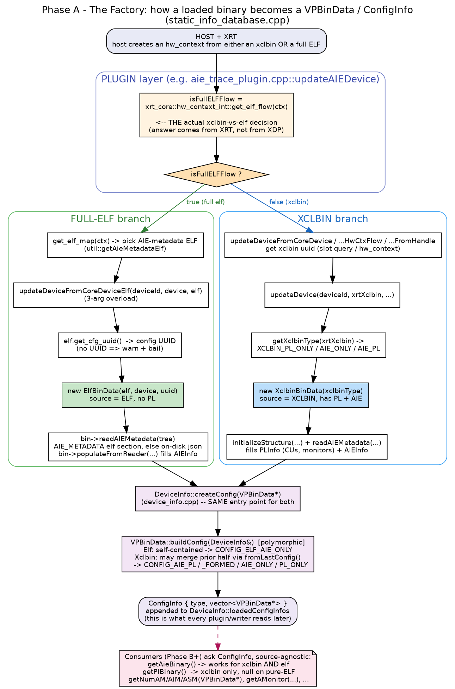

# Phase A — The Factory: where "xclbin vs Full-ELF" is decided

**File:** `profile/database/static_info_database.cpp` (+ the plugin that calls it)
**Diagram:** `diagrams/phaseA_factory.png`



## The one-sentence takeaway
XDP does **not** decide xclbin-vs-elf by inspecting the binary. It **asks XRT**:
`xrt_core::hw_context_int::get_elf_flow(ctx)`. That boolean picks one of two
factory functions, both of which end at the *same* `DeviceInfo::createConfig()`.

## Where the decision is made (in the PLUGIN, not the database)

In `aie_trace_plugin.cpp` the plugin computes `isFullELFFlow` from the
hw_context, then branches:

```98:102:profile/plugin/aie_trace/aie_trace_plugin.cpp
  bool isFullELFFlow = false;
  if (hw_context_flow) {
    xrt::hw_context ctx = xrt_core::hw_context_int::create_hw_context_from_implementation(handle);
    try {
      isFullELFFlow = xrt_core::hw_context_int::get_elf_flow(ctx);
```

```147:173:profile/plugin/aie_trace/aie_trace_plugin.cpp
  // Update the static database with information from the ELF or the xclbin
  if (isFullELFFlow) {
    ...
    auto elf = util::getAieMetadataElf(elfMap);
    ...
    (db->getStaticInfo()).updateDeviceFromCoreDeviceElf(deviceID, device, std::move(*elf));
  }
  else {
    ...
      (db->getStaticInfo()).updateDeviceFromCoreDeviceHwCtxFlow(deviceID, device, handle, hw_context_flow, true, ...);
    ...
  }
```

The **same `get_elf_flow()` + branch** pattern is repeated in the other plugins
you touched: `aie_profile_plugin.cpp` (~L152), `aie_halt_plugin.cpp` (~L98),
`ml_timeline_plugin.cpp` (~L160/276). That repetition is *why* your change spans
many files — each plugin is an independent entry point that must learn the flow.

## Branch 1 — Full ELF factory

`updateDeviceFromCoreDeviceElf(deviceId, device, elf)` (the **3-arg** overload):

```1712:1777:profile/database/static_info_database.cpp
  void
  VPStaticDatabase::
  updateDeviceFromCoreDeviceElf(uint64_t deviceId,
                                std::shared_ptr<xrt_core::device> device,
                                xrt::elf elf)
  {
    xrt_core::uuid elfUuid;
    try { elfUuid = elf.get_cfg_uuid(); }         // <-- identity comes from ELF
    catch (...) { /* warn + return */ }
    ...
    // de-dup: if current config already has this uuid, skip
    auto bin = std::make_unique<ElfBinData>(std::move(elf), std::move(device), elfUuid);
    auto reader = bin->readAIEMetadata(aieTree);  // ELF section, else disk json
    if (reader) { bin->populateFromReader(*reader); ... }
    devInfo->createConfig(bin.release());          // <-- common exit
    devInfo->isReady = true;
  }
```

Notes:
- There is also a **2-arg** `updateDeviceFromCoreDeviceElf(deviceId, device)` — a
  *disk-only* path that just registers a metadata reader and creates **no**
  binary. Don't confuse the two (ml_timeline uses the 2-arg one).
- ELF identity = `get_cfg_uuid()`. No PL is ever created here.

## Branch 2 — Xclbin factory

Several entry wrappers (`updateDeviceFromHandle`, `updateDeviceFromCoreDevice`,
`updateDeviceFromCoreDeviceHwCtxFlow`) all resolve an xclbin UUID (via the
`xclbin_slots` query or the hw_context) and funnel into `updateDevice(...)`:

```2716:2795:profile/database/static_info_database.cpp
  DeviceInfo* VPStaticDatabase::updateDevice(uint64_t deviceId, xrt::xclbin xrtXclbin, ...)
  {
    BinaryInfoType xclbinType = getXclbinType(xrtXclbin);   // PL_ONLY/AIE_ONLY/AIE_PL
    ...
    XclbinBinData* currentXclbin = new XclbinBinData(xclbinType) ;
    currentXclbin->setUuid(xrtXclbin.get_uuid());
    ...
    if (readAIEdata) { readAIEMetadata(...); setAIEGeneration(...); }
    if (!initializeStructure(currentXclbin, xrtXclbin)) { ... }   // fills PLInfo
    devInfo->createConfig(currentXclbin);                          // <-- common exit
    ...
    initializeProfileMonitors(devInfo, std::move(xrtXclbin));
    if (xdpDevice != nullptr) createPLDeviceIntf(...);
    return devInfo;
  }
```

## The convergence point (this is the elegant part)

Both branches call **`DeviceInfo::createConfig(VPBinData*)`**. Inside, the object
builds its own `ConfigInfo` polymorphically via `VPBinData::buildConfig()`:
- `ElfBinData::buildConfig` → self-contained `CONFIG_ELF_AIE_ONLY`.
- `XclbinBinData::buildConfig` → may look at the device's *previous* config and
  merge the complementary half (`fromLastConfig`) to form `CONFIG_AIE_PL_FORMED`,
  else `CONFIG_AIE_PL / AIE_ONLY / PL_ONLY`.

After this point **nothing downstream needs to know the source** — plugins and
writers read through `ConfigInfo` / `VPBinData` accessors (that's Phase B).

## Self-check questions (try to answer, then tell me and I'll correct you)
1. If the host loads an AIE-only xclbin *after* a PL-only xclbin, which
   `ConfigInfoType` results, and which function performed the merge?
2. In the Full-ELF branch, what are the *two* sources `readAIEMetadata()` tries,
   and in what order?
3. Why must `elfUuid` be copied into a local *before* `std::make_unique<ElfBinData>(std::move(elf), ...)`?
4. Which single XRT call is the real "xclbin vs elf" oracle, and which layer
   (plugin/database/device/writer) calls it?
