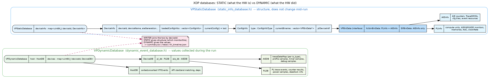

# Concepts deep-dive (answers to 6 questions)

Diagram for Q1/Q2: `diagrams/databases.png`



---

## Q1. What are `DeviceInfo` and `ConfigInfo`, and how are they stored in the STATIC db?

Think of a strict ownership chain, all inside `VPStaticDatabase`:

```
VPStaticDatabase
  └── std::map<uint64_t /*deviceId*/, std::unique_ptr<DeviceInfo>> deviceInfo
        └── DeviceInfo
              └── std::vector<std::unique_ptr<ConfigInfo>> loadedConfigInfos
                    └── ConfigInfo
                          └── std::vector<VPBinData*> currentBinaries
                                └── XclbinBinData / ElfBinData
```

- **`DeviceInfo`** = everything about **one physical/emulated device** and its
  *history*. Fields that never change (deviceId, deviceName, aieGeneration,
  isEdgeDevice...) plus `loadedConfigInfos` — the full history of every config
  loaded on that device. `currentConfig()` returns the most recent one.
  (`device_info.h`)

- **`ConfigInfo`** = **one loaded configuration** = the set of binaries active
  together. It holds `type` (`ConfigInfoType`) + `currentBinaries`
  (`vector<VPBinData*>`) + the PL device interface. It *owns* the binaries and
  deletes them in `~ConfigInfo()`. (`xclbin_info.h`)

- **Storage location:** the map lives in `VPStaticDatabase`:
```97:97:profile/database/static_info_database.h
    std::map<uint64_t, std::unique_ptr<DeviceInfo>> deviceInfo;
```
- **Why a *vector* of configs, and a *vector* of binaries?**
  - Vector of configs: an app can load several xclbins/elfs over its lifetime;
    we keep them all so the end-of-run summary is complete.
  - Vector of binaries: one config can be, e.g., an AIE-only xclbin merged with a
    prior PL-only xclbin (`CONFIG_AIE_PL_FORMED`). A pure ELF config has exactly
    one binary.

---

## Q2. What does the DYNAMIC db contain, and where is it used?

`VPDynamicDatabase` (`dynamic_event_database.h`) holds the *values collected while
the app runs*:
```61:66:profile/database/dynamic_event_database.h
    std::unique_ptr<HostDB> host = nullptr;
    ...
    std::map<uint64_t, std::unique_ptr<DeviceDB>> devices;
```
- **`HostDB`** — host-side trace events (`VTFEvent`s), API start/end matching,
  OpenCL/user-range dependencies. (`dynamic_info/host_db.h`)
- **`DeviceDB`** per device = `PLDB` + `AIEDB`:
  - `PLDB` — PL trace events, PL counter results, power samples, deadlock info.
  - `AIEDB` — `traceDataMap` (raw AIE trace per `io_type`), profile samples,
    timer samples, debug samples. (`dynamic_info/aie_db.h`)

**Used where:**
- **Written by** plugins/device layer as data arrives (e.g.
  `addAIETraceData`, `addAIESample`, `addPLTraceEvent`).
- **Read by** the WRITER layer at teardown, joined with STATIC by `deviceId` to
  produce `summary.csv`, trace files, and `ml_timeline.json`.

Rule of thumb: **STATIC = structure/nouns, DYNAMIC = values/verbs.** A writer
needs both — STATIC says "monitor 3 is an AIM on CU foo", DYNAMIC says "it
counted 12345".

---

## Q3. Control code — what is it, what's in it, where from, how used?

**What:** "Control code" is the little program XDP itself generates to
**configure the AIE hardware** to do profiling/tracing — it programs AIE
registers (which counters, which events, trace routing). It is *not* the user's
design; XDP builds it on the fly.

**What it contains:** a list of AIE register writes captured as a **transaction**
— columns/rows/offsets/values — then assembled into an `.asm` and compiled to an
`.elf`. See the members in `ve2_transaction.h`:
```66:71:profile/device/common/ve2/ve2_transaction.h
      std::vector<uint8_t> m_columns;
      std::vector<uint8_t> m_rows;
      std::vector<uint64_t> m_offsets;
      std::vector<uint32_t> m_values;
```

**Where from:** the plugin reads the STATIC db (tiles/counters to program),
drives the AIE driver (`XAie_*`) to record a transaction, then
`completeASM() -> generateELF()`.

**How used (submission) — this is the xclbin-vs-fullelf fork in the DEVICE layer:**
```200:213:profile/device/common/ve2/ve2_transaction.cpp
        xrt::kernel kernel;
        if (m_fullElfFlow) {
            // Full-ELF flow: register the config ELF on the hw_context and
            // open the kernel by its (unique) name.
            hwContext.add_config(profileElf);
            kernel = xrt::ext::kernel{hwContext, fullElfKernelHandle(m_transactionName)};
        }
        else {
            // xclbin flow: wrap the partial ELF in a module and open the
            // XDP_KERNEL from it.
            xrt::module mod{profileElf};
            kernel = xrt::ext::kernel{hwContext, mod, "XDP_KERNEL:{IPUV1CNN}"};
        }
```
Then the kernel is run to push the control code into the AIE microcontroller.
`m_fullElfFlow` is set from the same `get_elf_flow()` decision as Phase A.

> Do not confuse the **two ELFs**:
> - the **design/config ELF** (input) → XDP *reads* AIE metadata from it;
> - XDP's **own control-code ELF** (output) → XDP *writes/submits* it to program HW.

AIE Trace additionally needs a **flush ELF** to force trace packets out of the
tiles at end-of-run (`prepareFlushKernel`/`runFlushKernel`); split in two because
the flush happens during teardown when some XRT statics may be gone.

---

## Q4. Where does `xrt::elf` come from?

Two different `xrt::elf` objects, matching the two ELFs above:

1. **Design ELF (input, Full-ELF flow):** comes from the **hw_context's ELF map**.
   The plugin does `get_elf_map(ctx)` then picks the *design* ELF (the one XDP did
   not submit itself):
```107:117:profile/device/utility.cpp
  std::optional<xrt::elf>
  getAieMetadataElf(const std::map<std::string, xrt::elf>& elfMap)
  {
    // The design ELF is the entry not submitted by XDP itself.
    // XDP's own ELFs use "XDP_KERNEL"-prefixed kernel-name keys
    for (const auto& entry : elfMap) {
      if (isXdpInternalKernel(entry.first))
        continue;
      return entry.second;
```
   This is the `xrt::elf` handed to `updateDeviceFromCoreDeviceElf(...)` and stored
   in `ElfBinData`.

2. **Control-code ELF (output):** XDP constructs it from the file it just
   generated: `profileElf = xrt::elf(getElfFileName());` in `submitELF()`.

So: input ELFs are **provided by XRT via the hw_context**; the output ELF is
**built by XDP** and loaded from disk.

---

## Q5. What useful things does the AIE metadata contain?

The metadata reader interface `aie::BaseFiletypeImpl`
(`static_info/filetypes/base_filetype_impl.h`) is the single source of AIE
structure. It exposes, among others:
- `getHardwareGeneration()`, `getAIEClockFreqMHz()` — device generation & clock.
- `getDriverConfig()`, `getAIECompilerOptions()`.
- `getNumRows()`, `getAIETileRowOffset()`, `getPartitionOverlayStartCols()` —
  the AIE array geometry / partition layout.
- `getValidGraphs()/Ports()/Kernels()/Buffers()` — the design's logical objects.
- `getGMIOs()`, `getTraceGMIOs()` — the DDR streaming endpoints (trace offload).
- `getInterfaceTiles()`, `getMemoryTiles()`, `getAIETiles()`, `getEventTiles()`,
  `getTiles()`, `getMicrocontrollers()`, `getActiveMicroControllers()` — the
  actual tiles the plugin will program.

**Source of the metadata:**
- xclbin flow → an AXLF section (e.g. `AIE_METADATA`) or on-disk
  `aie_trace_config.json` / `aie_control_config.json`.
- full-elf flow → the ELF's `AIE_METADATA` custom section first, then disk JSON
  fallback (`ElfBinData::readAIEMetadata`).

This metadata is what fills the **AIEInfo** in STATIC and tells the plugin which
tiles/counters to configure.

---

## Q6. What is a `hw_context`, what does it do, where from?

`xrt::hw_context` is an **XRT** object (not XDP's) representing a **loaded
configuration on a device** — a "hardware context". Conceptually: "this device,
configured by this binary (xclbin or set of ELFs), ready to run kernels."

- **What it does for XDP:** it is the handle through which XDP learns about and
  talks to the running design:
  - `context.get_xclbin_uuid()` — identity of the loaded xclbin.
  - `get_elf_flow(context)` — **the xclbin-vs-fullelf oracle** (Phase A).
  - `get_elf_map(context)` — the registered ELFs (design + XDP's).
  - `get_partition_size(context)` — AIE partition columns (used for full-elf
    trace, e.g. `numColumns = partitionSize`).
  - `context.add_config(elf)` — register XDP's control-code ELF onto it.
- **Where it comes from:** the **host application** creates it via XRT when it
  loads a design. XDP receives an opaque `hwCtxImpl` handle in its callbacks and
  reconstructs the object with
  `xrt_core::hw_context_int::create_hw_context_from_implementation(handle)`.

In short: the host owns the hw_context; XDP borrows it to (a) discover what's
loaded and (b) inject its profiling/trace control code.

---

### Quick cross-reference of the two "flows"
| Aspect | xclbin flow | full-elf flow |
|---|---|---|
| decision | `get_elf_flow()==false` | `get_elf_flow()==true` |
| binary type | `XclbinBinData` (PL+AIE) | `ElfBinData` (AIE only) |
| metadata src | AXLF section / disk json | ELF `AIE_METADATA` / disk json |
| control code submit | `xrt::module{elf}` + `XDP_KERNEL` | `hwContext.add_config(elf)` |
| PL support | yes | none (`getPl()` throws) |
