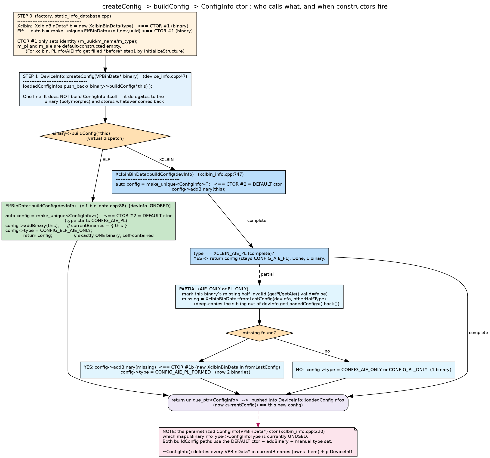

# createConfig / buildConfig / ConfigInfo & DeviceInfo constructors

Goal: nail down **who calls what, in what order, and exactly when each
constructor fires.** Diagram: `diagrams/createconfig_buildconfig.png`.



## The one-paragraph mental model
`createConfig` is a thin **dispatcher**: it does not build a `ConfigInfo` itself.
It asks the *binary* to build its own config (`buildConfig`, virtual), and stores
the returned `unique_ptr<ConfigInfo>` in the device's history. `buildConfig` is
where the `ConfigInfo` is actually constructed (via the **default** ctor) and
shaped (`type` + which binaries it contains). So the order is always:

```
new XclbinBinData / ElfBinData        (CTOR #1: the binary)
        │
DeviceInfo::createConfig(binary)      (dispatcher, 1 line)
        │  binary->buildConfig(*this) (virtual)
        ▼
make_unique<ConfigInfo>()             (CTOR #2: the config, DEFAULT ctor)
config->addBinary(...) ; config->type = ...
        ▼
returned & push_back into DeviceInfo::loadedConfigInfos
```

## Constructor timeline (the part that was vague)

There are **two** constructions per load, and they happen at different layers:

1. **CTOR #1 — the binary** (`XclbinBinData` / `ElfBinData`), in the *factory*
   (`static_info_database.cpp`), **before** `createConfig`.
   - It only sets identity: `m_uuid`, `m_name`, `m_type`. The `PLInfo m_pl` and
     `AIEInfo m_aie` members are just default-constructed (empty) here.
   - For the **xclbin** path, `m_pl`/`m_aie` are then *populated* by
     `initializeStructure()` / `readAIEMetadata()` — still before `createConfig`.
   - For the **elf** path, `m_aie` is populated by `populateFromReader()` — again
     before `createConfig`.
   > Takeaway: by the time `createConfig` runs, the binary is already fully
   > populated. `buildConfig` only decides *packaging*, never fills PL/AIE data.

2. **CTOR #2 — the `ConfigInfo`**, inside `buildConfig`, via the **default**
   ctor `ConfigInfo() : type(CONFIG_AIE_PL) {}`. Then `addBinary()` + a manual
   `type =` set the real shape.

### `DeviceInfo` has no interesting constructor
`DeviceInfo` is a plain struct; it is created once per device in the factory
(`deviceInfo[deviceId] = std::make_unique<DeviceInfo>();`) and simply
accumulates `ConfigInfo`s in `loadedConfigInfos`. Its `~DeviceInfo()` tears down
those configs.

## `DeviceInfo::createConfig` — the dispatcher

```47:52:profile/database/static_info/device_info.cpp
  void DeviceInfo::createConfig(VPBinData* binary)
  {
    // Source-specific config construction lives on the binary itself
    //  (VPBinData::buildConfig).
    loadedConfigInfos.push_back(binary->buildConfig(*this));
  }
```
That's the entire function. The `*this` it passes lets `buildConfig` look back at
the device's *previous* configs (needed only for the xclbin merge case).

## `ElfBinData::buildConfig` — trivial, self-contained

```88:94:profile/database/static_info/elf_bin_data.cpp
  ElfBinData::buildConfig(DeviceInfo& /*devInfo*/)
  {
    auto config = std::make_unique<ConfigInfo>();   // default ctor
    config->addBinary(this);
    config->type = CONFIG_ELF_AIE_ONLY;
    return config;
  }
```
`devInfo` is ignored — an ELF never merges with anything. Always exactly one
binary, type `CONFIG_ELF_AIE_ONLY`.

## `XclbinBinData::buildConfig` — may merge a sibling

```747:785:profile/database/static_info/xclbin_info.cpp
    XclbinBinData::buildConfig(DeviceInfo& devInfo)
    {
      auto config = std::make_unique<ConfigInfo>();   // default ctor
      config->addBinary(this);
      auto currentBinaryType = getType();

      if (currentBinaryType == XCLBIN_AIE_PL)
        return config;                                 // complete -> CONFIG_AIE_PL

      // partial: mark my missing half invalid, then look for the sibling
      VPBinData* missingBinary = nullptr;
      if (currentBinaryType == XCLBIN_AIE_ONLY) {
        getPl().valid = false;
        missingBinary = XclbinBinData::fromLastConfig(devInfo, XCLBIN_PL_ONLY);
      } else {
        getAie().valid = false;
        missingBinary = XclbinBinData::fromLastConfig(devInfo, XCLBIN_AIE_ONLY);
      }

      if (missingBinary) {
        ...
        config->addBinary(missingBinary);
        config->type = CONFIG_AIE_PL_FORMED;           // 2 binaries
      } else {
        config->type = (currentBinaryType == XCLBIN_AIE_ONLY)
                       ? CONFIG_AIE_ONLY : CONFIG_PL_ONLY;   // 1 binary
      }
      return config;
    }
```
- **Complete xclbin (AIE+PL):** one binary, `CONFIG_AIE_PL`, no device lookback.
- **Partial xclbin:** disables its own missing half, then `fromLastConfig` deep-
  copies the complementary binary out of `devInfo.getLoadedConfigs().back()`.
  If found → two binaries, `CONFIG_AIE_PL_FORMED`; else → `CONFIG_AIE_ONLY`/
  `CONFIG_PL_ONLY`. `fromLastConfig` is the ONE place that news up a *second*
  `XclbinBinData` (CTOR #1b).

## `ConfigInfo` constructors & destructor

```105:107:profile/database/static_info/xclbin_info.h
    ConfigInfo() : type(CONFIG_AIE_PL) {};
    ConfigInfo(VPBinData* binary) ;
    ~ConfigInfo() ;
```
- **Default ctor** — used by both `buildConfig` paths. `type` starts
  `CONFIG_AIE_PL`, `currentBinaries` empty.
- **Parametrized ctor `ConfigInfo(VPBinData*)`** — maps `BinaryInfoType ->
  ConfigInfoType` and pushes the binary. **Currently UNUSED** (dead/legacy): the
  live code always uses the default ctor + `addBinary` + explicit `type=`. Good
  to know so you don't hunt for callers that don't exist.
- **Destructor** — `ConfigInfo` *owns* its binaries:
```234:244:profile/database/static_info/xclbin_info.cpp
  ConfigInfo::~ConfigInfo()
  {
    for (auto bin : currentBinaries)
      delete bin;                 // deletes through VPBinData* (virtual dtor)
    currentBinaries.clear();
    if (plDeviceIntf) { delete plDeviceIntf; plDeviceIntf = nullptr; }
  }
```
  This is why the factory hands the raw pointer over with `bin.release()` /
  `new`: ownership transfers into `ConfigInfo`.

## End-to-end ordering (single load)
1. Factory: `new`/`make_unique` the binary  → **CTOR #1**.
2. Factory: populate binary's PL/AIE (`initializeStructure`/`populateFromReader`).
3. Factory: `devInfo->createConfig(binary)`.
4. `createConfig` → `binary->buildConfig(*this)` (virtual).
5. `buildConfig`: `make_unique<ConfigInfo>()` → **CTOR #2 (default)**; `addBinary`;
   set `type`; (xclbin partial only) `fromLastConfig` may **CTOR #1b** a sibling.
6. returned `unique_ptr<ConfigInfo>` `push_back` into `loadedConfigInfos`;
   `currentConfig()` now points at it.
7. Later teardown: `~DeviceInfo` → `~ConfigInfo` → `delete` each binary.
