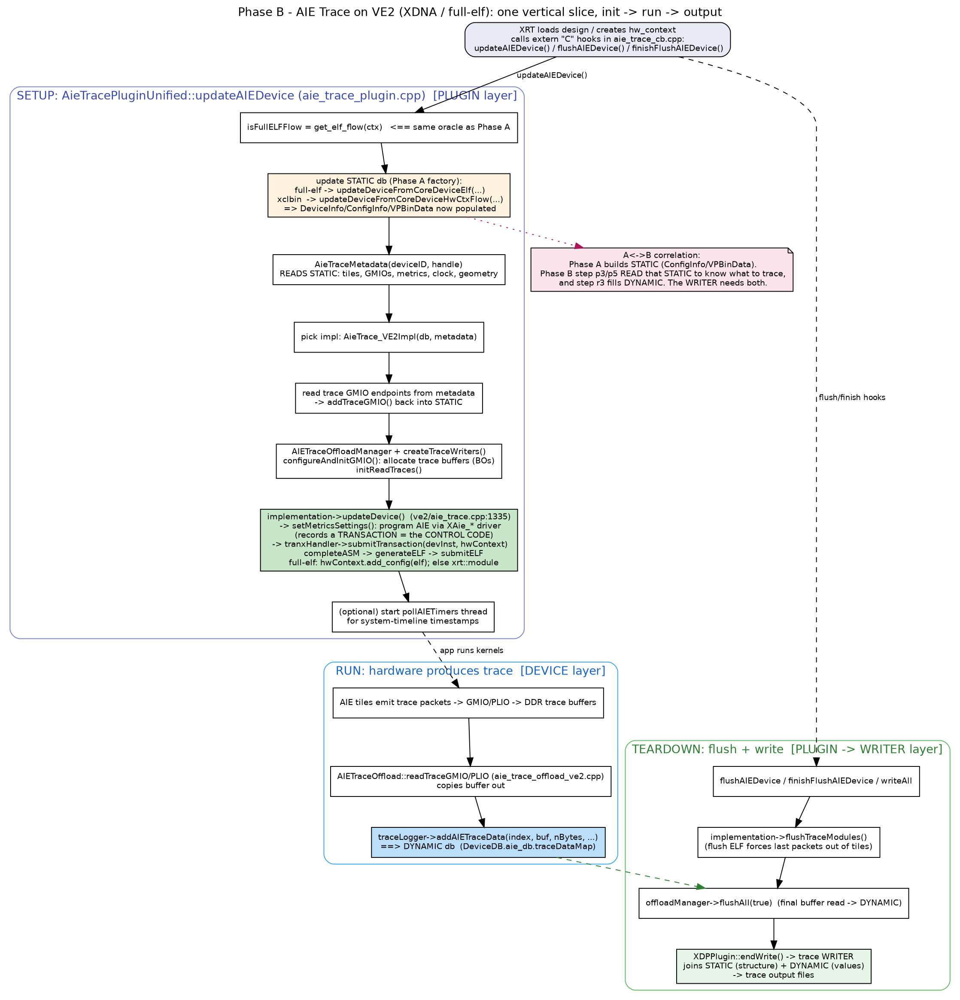

# Phase B — AIE Trace on VE2: the vertical slice (init → run → output)

This is the "spine" of XDP: one feature traced end-to-end. Once you see this,
every other plugin is the same shape with different data. Focus: VE2 XDNA /
full-elf path. Diagram: `diagrams/phaseB_slice.png`.



## 0. How XRT even reaches XDP (the hooks)

The plugin is a **single static instance** plus three `extern "C"` callbacks XRT
calls by name (dlopen/dlsym) — this is the plugin registration mechanism:

```27:45:profile/plugin/aie_trace/aie_trace_cb.cpp
  static AieTracePluginUnified aieTracePluginInstance;
  static void updateAIEDevice(void* handle, bool hw_context_flow) { ... aieTracePluginInstance.updateAIEDevice(...); }
  static void flushAIEDevice(void* handle) { ... }
  static void finishFlushAIEDevice(void* handle) { ... }
```
The plugin **constructor** registers itself with the database:
```50:56:profile/plugin/aie_trace/aie_trace_plugin.cpp
AieTracePluginUnified::AieTracePluginUnified() : XDPPlugin() {
  db->registerPlugin(this);
  db->registerInfo(info::aie_trace);
  db->getStaticInfo().setAieApplication();
}
```
So lifecycle = ctor (register) → `updateAIEDevice` (setup) → run → flush hooks →
dtor (`writeAll`).

## 1. SETUP — `updateAIEDevice()` (the big function)

Order of operations (all in `aie_trace_plugin.cpp`):

1. **Decide flow & update STATIC (this is Phase A):**
   `isFullELFFlow = get_elf_flow(ctx)` → call the matching factory
   (`updateDeviceFromCoreDeviceElf` for full-elf, else `...HwCtxFlow`). After
   this, the `DeviceInfo`/`ConfigInfo`/`VPBinData` for this device exist and are
   populated. **Phase B literally starts by invoking Phase A.**

2. **Build metadata (READ STATIC):**
   ```177:189:profile/plugin/aie_trace/aie_trace_plugin.cpp
   AIEData.metadata = std::make_shared<AieTraceMetadata>(deviceID, handle);
   if (AIEData.metadata->aieMetadataEmpty()) { ... return; }
   if (AIEData.metadata->configMetricsEmpty()) { ... return; }
   ```
   `AieTraceMetadata` pulls tiles/GMIOs/metrics/clock/geometry out of the static
   DB + xrt.ini. This is the plugin figuring out **what to trace**.

3. **Pick the platform implementation** (compile-time):
   ```202:207:profile/plugin/aie_trace/aie_trace_plugin.cpp
   #elif defined(XDP_VE2_BUILD) && !defined(XDP_VE2_ZOCL_BUILD)
     AIEData.metadata->setHwContext(context);
     AIEData.implementation = std::make_unique<AieTrace_VE2Impl>(db, AIEData.metadata);
   ```
   `AieTrace_VE2Impl` is the VE2/XDNA backend (talks to the AIE driver directly).

4. **Register trace GMIOs into STATIC** (`addTraceGMIO`), then compute
   `numStreamsPLIO/GMIO`.

5. **Offload plumbing:** create `AIETraceOffloadManager`, create trace writers,
   `configureAndInitGMIO()` (allocate DDR trace buffers/BOs), `initReadTraces()`.

6. **Program the hardware = submit control code:**
   ```391:391:profile/plugin/aie_trace/aie_trace_plugin.cpp
   AIEData.implementation->updateDevice();
   ```
   Inside `AieTrace_VE2Impl::updateDevice()`:
   ```1335:1355:profile/plugin/aie_trace/ve2/aie_trace.cpp
   void AieTrace_VE2Impl::updateDevice()
   {
     if(!metadata->getRuntimeMetrics()) return;
     ... getAIEPartitionInfo(...) ...
     if (!setMetricsSettings(metadata->getDeviceID(), metadata->getHandle())) { ... return; }
     ...
   }
   ```
   `setMetricsSettings()` walks the configured tiles and programs AIE registers
   via the `XAie_*` driver — these register writes are recorded as a
   **transaction** (the control code from note 04/Q3). It is then
   `submitTransaction()` → `generateELF()` → `submitELF()`:
   full-elf uses `hwContext.add_config(elf)`; xclbin uses `xrt::module`.

7. **(optional) system-timeline thread:** `pollAIETimers` samples AIE timers.

## 2. RUN — hardware produces trace

While the app runs kernels, AIE tiles emit trace packets that stream (GMIO/PLIO)
into the DDR buffers allocated in step 5. The offload reads them:
```531:531:profile/device/aie_trace/ve2/aie_trace_offload_ve2.cpp
    traceLogger->addAIETraceData(index, hostBuf, nBytes, mEnCircularBuf);
```
`addAIETraceData` is the door into the **DYNAMIC** database
(`DeviceDB.aie_db.traceDataMap`). This is the counterpart to Phase A: A filled
STATIC (structure), the run fills DYNAMIC (values).

> Full-elf detail (commit 1ed22ac): for the full-elf flow, trace offload uses
> `numColumns = get_partition_size(context)` instead of metadata `num_columns`,
> because traced tiles are partition-relative:
> ```201:207:profile/device/aie_trace/ve2/aie_trace_offload_ve2.cpp
>   uint8_t numColumns = meta_config.num_columns;
>       size_t partitionSize = xrt_core::hw_context_int::get_partition_size(context);
>       if (partitionSize > 0)
>         numColumns = static_cast<uint8_t>(partitionSize);
> ```

## 3. TEARDOWN — flush + write

On the flush hooks (or dtor `writeAll`):
```441:443:profile/plugin/aie_trace/aie_trace_plugin.cpp
  AIEData.implementation->flushTraceModules();
  if (AIEData.offloadManager)
    AIEData.offloadManager->flushAll(false);
```
- `flushTraceModules()` submits a **flush ELF** to force the last trace packets
  out of the tiles (see note 04/Q3 + `prepareFlushKernel`).
- `flushAll()` does the final buffer read → DYNAMIC.
- `XDPPlugin::endWrite()` runs the **writers**, which join STATIC (which tile is
  what) + DYNAMIC (the trace values) into the output trace files.

## A ↔ B correlation (the mapping you asked to see clearly)
```
Phase A (factory)                    Phase B (this slice)
-----------------                    --------------------
get_elf_flow() decides flow  <====   step 1 calls the SAME oracle, then the factory
builds VPBinData -> ConfigInfo  ==>   step 2 (AieTraceMetadata) READS it: what to trace
   (STATIC, structure)                step 6 programs HW from that structure (control code)
                                      run: addAIETraceData fills DYNAMIC (values)
                                      teardown: WRITER = STATIC (structure) + DYNAMIC (values)
```
STATIC is written once at load (Phase A) and read throughout Phase B; DYNAMIC is
written during the run and read at teardown. The writer is where the two meet.

## Self-check
1. Name the 3 `extern "C"` hooks XRT calls, and which one triggers control-code
   submission.
2. Which object turns static-DB structure into "the list of tiles to trace"?
3. Where exactly does trace data enter the DYNAMIC database (function name)?
4. Why is a separate *flush* ELF needed at teardown instead of reusing the setup
   control-code ELF?
