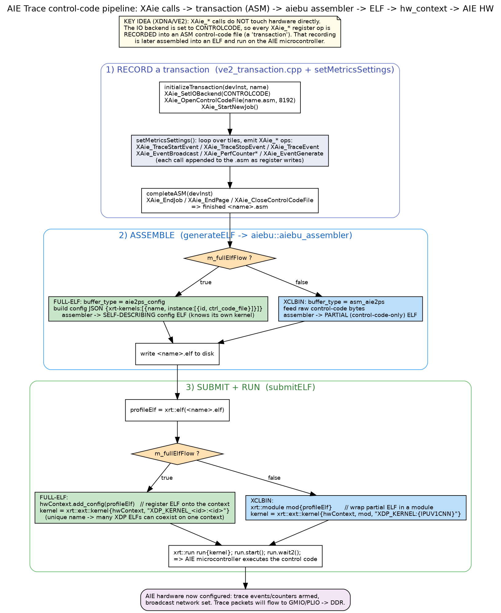

# setMetricsSettings, XAie / transactions, add_config vs module, the assembler, ELF types

Diagram: `diagrams/controlcode_pipeline.png`



---

## 1. `setMetricsSettings()` - what it does & its flow

It is the function that **turns "which tiles to trace" into actual AIE hardware
configuration**, packaged as control code. (`ve2/aie_trace.cpp:1456`, XDNA path.)

Flow, in order:

1. **Guard:** bail if metrics invalid (`getIsValidMetrics()`).
2. **Partition geometry:** `getAIEPartitionInfo(handle)` -> start col / num cols;
   `startColShift` from metadata.
3. **Begin a transaction (start recording control code):**

`ve2/aie_trace.cpp:1477-1481`

```cpp
if (!tranxHandler->initializeTransaction(&aieDevInst, tranxName)) { ... return false; }
```

4. **Per-tile configuration loop** over `metadata->getConfigMetrics()`:
   - work out module type (core / mem / mem_tile / shim), tile `loc`.
   - remember the tile in `traceFlushLocs` / `memoryTileTraceFlushLocs` /
     `interfaceTileTraceFlushLocs` (needed for the flush ELF later).
   - emit the AIE register ops for the chosen metric set: `XAie_TraceStopEvent`,
     `XAie_TraceEvent`, packet setup, counters, etc.
   - build an `aie_cfg_tile` and push it into **STATIC** via `addAIECfgTile()`
     (so writers later know what each tile was doing).
5. **Trace-start broadcast network** (`build2ChannelBroadcastNetwork` +
   `XAie_EventGenerate`) so all tiles start together.
6. **Submit the metrics transaction:** `tranxHandler->submitTransaction(...)`
   (completeASM -> generateELF -> submitELF -> run). This is the control-code ELF
   #2 (see section 6).
7. **Build a second transaction = the flush ELF:** re-`initializeTransaction`,
   emit `XAie_EventGenerate(endEvent)` for every stored flush location,
   `completeASM` + `generateELF`, then `prepareFlushKernel()` (pre-create the
   kernel now, run it at teardown).

So `setMetricsSettings` produces **two** ELFs: the *metrics* ELF (run now) and
the *flush* ELF (run at end-of-run).

---

## 2. XAie APIs, `devInst`, and what a "transaction" is

- **XAie_\* APIs** = the **AI Engine driver library** (aka aie-rt / xaiengine).
  They are the low-level C API for programming AIE tiles: set trace events,
  counters, broadcasts, read timers, etc. (`XAie_TraceEvent`,
  `XAie_EventBroadcast`, `XAie_ReadTimer`, ...).
- **`devInst` (`XAie_DevInst`)** = the driver's **device-instance handle**: a
  struct describing the AIE array (base address, #rows/#cols, generation, IO
  backend). Every XAie call takes `&aieDevInst`. On VE2 it's fetched/cached in
  the static DB:

`ve2/aie_trace.cpp:1212-1217`

```cpp
void* AieTrace_VE2Impl::setAieDeviceInst(void* handle, uint64_t deviceID)
{
  aieDevInst = static_cast<XAie_DevInst*>(db->getStaticInfo().getAieDevInst(fetchAieDevInst, handle, deviceID));
  ...
}
```

- **Transaction** = a *recording* of XAie register operations instead of
  executing them live. The trick (XDNA/VE2): switch the IO backend to
  **CONTROLCODE**, so XAie calls are appended to an ASM control-code file:

`ve2_transaction.cpp:63-85`

```cpp
bool VE2Transaction::initializeTransaction(XAie_DevInst* aieDevInst, std::string tName)
{
    setTransactionName(tName);
    ...
    XAie_SetIOBackend(aieDevInst, XAIE_IO_BACKEND_CONTROLCODE);
    XAie_OpenControlCodeFile(aieDevInst, getAsmFileName().c_str(), 8192);
    XAie_StartNewJob(aieDevInst, XAIE_START_JOB);
    ...
}
```

`completeASM()` closes it (`XAie_EndJob/EndPage/CloseControlCodeFile`).

> Why record instead of write directly? On XDNA the AIE is owned by the XDNA
> driver (not the Linux AIE driver), so XDP cannot poke registers directly - it
> hands a compiled program to the AIE microcontroller instead.

---

## 3. `add_config(elf)` vs `xrt::module` - full-elf vs xclbin submission

Both live in `submitELF()` (and `prepareFlushKernel()`):

`ve2_transaction.cpp:200-213`

```cpp
xrt::kernel kernel;
if (m_fullElfFlow) {
    hwContext.add_config(profileElf);
    kernel = xrt::ext::kernel{hwContext, fullElfKernelHandle(m_transactionName)};
} else {
    xrt::module mod{profileElf};
    kernel = xrt::ext::kernel{hwContext, mod, "XDP_KERNEL:{IPUV1CNN}"};
}
```

- **Full-ELF: `hwContext.add_config(profileElf)`**
  - The ELF is **self-describing** (it was built with a config JSON naming its
    own kernel + `ctrl_code_file`). `add_config` **registers that ELF onto the
    hw_context** - i.e. adds it to the context's ELF map alongside the design.
  - The kernel is then opened by its **unique handle** `XDP_KERNEL_<id>:<id>`.
    Uniqueness matters because multiple XDP ELFs (profile, trace, flush,
    halt...) are `add_config`'d onto the *same* context and must not collide.
  - No xclbin required - this is the whole point of the Full-ELF flow.

- **xclbin: `xrt::module mod{profileElf}`**
  - The ELF is a **partial** (control-code-only) ELF. `xrt::module` **wraps** it
    so it can be bound as a kernel within the already-loaded xclbin's context.
  - Kernel opened via the module with the fixed name `XDP_KERNEL:{IPUV1CNN}`.

In both cases: `xrt::run run{kernel}; run.start(); run.wait2();` actually pushes
the control code to the AIE microcontroller and waits for completion.

---

## 4. What is the "assembler"?

The **AIEBU assembler** (`aiebu::aiebu_assembler`, from
`core/common/aiebu/.../aiebu_assembler.h`) converts the recorded ASM control
code into a runnable **ELF**. It's the "compiler" step of the pipeline
(`generateELF()`), with two modes matching the two flows:

`ve2_transaction.cpp:121-160`

```cpp
if (m_fullElfFlow) {
    const std::vector<char> configJson = loadXdpKernelFullElfConfig(asmFileName, m_transactionName);
    ...
    const aiebu::aiebu_assembler assembler(aiebu::aiebu_assembler::buffer_type::aie2ps_config,
                                           emptyCodeBuf, aiebuFlags, libPaths, configJson);
    elfBytes = assembler.get_elf();
} else {
    std::vector<char> controlCodeBuf;  // raw bytes of the .asm
    ...
    const aiebu::aiebu_assembler assembler(aiebu::aiebu_assembler::buffer_type::asm_aie2ps,
                                           controlCodeBuf, {}, libPaths);
    elfBytes = assembler.get_elf();
}
```

- **`aie2ps_config`** (full-elf): input is a **config JSON** that points at the
  ASM `ctrl_code_file`; output is a **self-describing config ELF**.
- **`asm_aie2ps`** (xclbin): input is the **raw control-code bytes**; output is a
  **partial ELF** meant to be wrapped by `xrt::module`.

("aie2ps" = the AIE2 microcontroller / processor subsystem target.)

---

## 5. The ELFs involved in trace (and a control-code ELF deep-dive)

There are up to **four** distinct ELFs; only the last three are *created by XDP*:

| ELF | Who makes it | Contains | Role in trace |
|-----|--------------|----------|---------------|
| **Design ELF** | the design/compiler (input) | AIE control code for the *design* + `AIE_METADATA` | XDP only **reads metadata** from it (full-elf flow) |
| **Metrics (control-code) ELF** `AieTraceMetrics<id>` | XDP `setMetricsSettings` | recorded XAie ops that arm trace events/counters + broadcast | run **once at setup** to configure the AIE for tracing |
| **Flush ELF** `AieTraceFlush<id>` | XDP `setMetricsSettings` | `XAie_EventGenerate(endEvent)` per tile | run **at teardown** to force trailing packets out |
| **Windowed ELF** `AieTraceWindow<id>` (optional) | XDP `configureWindowedEventTrace` | layer-based trace-start events | run when `start_type == layer` |

### Deep-dive: what's inside a control-code ELF and what happens when it runs

- It is essentially a tiny **program for the AIE microcontroller** (the aie2ps).
  The `.asm` is a linear list of primitive ops (register writes / poll / job
  markers) captured while the IO backend was CONTROLCODE.
- For **full-elf**, the assembler wraps that program with a config section
  describing a *kernel* (`XDP_KERNEL_<id>`) and its instance (`ctrl_code_file`),
  so the ELF can be `add_config`'d and opened as an `xrt::ext::kernel` with no
  xclbin. That's why it's called "self-describing".
- `run.start()` submits the program; the microcontroller **replays** the register
  writes onto the AIE tiles -> the trace hardware (event selectors, counters,
  packet routing) gets armed. `run.wait2()` blocks until the program finishes.
- The *metrics* ELF arms tracing; the *flush* ELF just fires the end events so
  buffered partial packets are emitted - it's a separate ELF because it must run
  at a different time (teardown), and it's pre-created (`prepareFlushKernel`) so
  running it doesn't touch XRT statics that may already be torn down.

---

## 6. `pollAIETimers` / system timeline (optional)

Purpose: periodically sample an AIE tile timer and pair it with host time so the
AIE trace timeline can be **aligned to the host/system timeline**.

- The plugin starts a background thread only if
  `AIE_trace_settings.enable_system_timeline` is set and the design is
  single-partition (`aie_trace_plugin.cpp` ~L345-384).
- The thread loops up to `max_timer_samples`, calling
  `implementation->pollTimers(index, handle)` every `pollingIntervalUs`.
- `pollTimers` (ZOCL/edge path) reads a timer and stores a sample bracketed by
  two host timestamps:

`ve2/aie_trace.cpp:1196-1206`

```cpp
  auto timestamp1 = xrt_core::time_ns();
  XAie_ReadTimer(aieDevInst, loc, falModuleType, &timerValue);
  auto timestamp2 = xrt_core::time_ns();
  ...
  db->getDynamicInfo().addAIETimerSample(index, timestamp1, timestamp2, values);
```

(`timestamp1`/`timestamp2` bracket the read so host<->AIE skew is bounded.)
The sample lands in the **DYNAMIC** DB (`addAIETimerSample`) and is later
written to `aie_event_timestamps.bin`.

> XDNA nuance: on the pure XDNA build `pollTimers` is a **no-op**
> (`ve2/aie_trace.cpp:2558`), because the AIE isn't directly readable
> (control-code backend). Live-timer system-timeline is effectively a ZOCL/edge
> feature; on XDNA the thread may start but records nothing.

---

## Self-check

1. Why does XDP *record* XAie ops into an ASM instead of executing them on XDNA?
2. What is the difference between the `aie2ps_config` and `asm_aie2ps` assembler
   modes, and which flow uses each?
3. Why must the full-elf kernel handle be unique (`XDP_KERNEL_<id>:<id>`)?
4. Why is the flush a *separate* ELF, and why is its kernel pre-created at setup?
