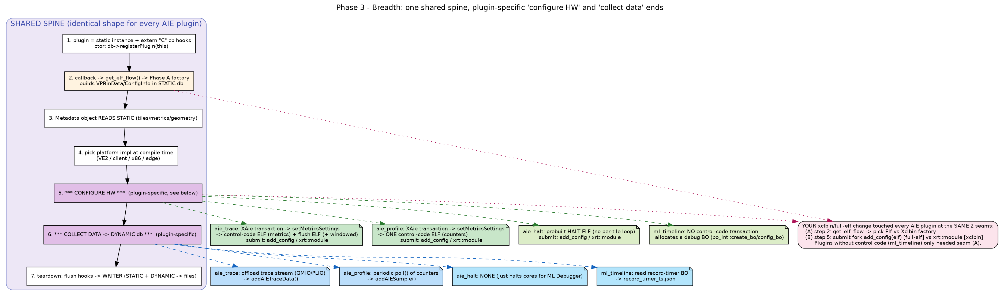

# Phase 3 — Breadth: how the other plugins reuse the same spine

Now that Phase B (aie_trace) is clear, the other AIE plugins are "same spine,
different ends". Diagram: `diagrams/phase3_breadth.png`.

## The shared spine (identical for every AIE plugin)

1. **Plugin object** = a single static instance + `extern "C"` callback hooks in
   `<plugin>_cb.cpp`; the constructor calls `db->registerPlugin(this)`.
2. **Callback → flow decision → factory:** `get_elf_flow()` picks the Phase A
   factory (`updateDeviceFromCoreDeviceElf` vs the xclbin path) → populates
   `VPBinData`/`ConfigInfo` in the **STATIC** db.
3. **Metadata object** reads STATIC (tiles, metrics, geometry).
4. **Platform impl** chosen at compile time (`VE2` / `client` / `x86` / `edge`).
5. **Configure HW** — plugin-specific.
6. **Collect data → DYNAMIC db** — plugin-specific.
7. **Teardown** — flush hooks → WRITER joins STATIC + DYNAMIC → output files.

Steps 1–4 and 7 are essentially copy-paste across plugins. All the interesting
variation is in **step 5 (configure)** and **step 6 (collect)**.

## Where plugins diverge

| Plugin | Configure HW (step 5) | Collect data (step 6) | Extra ELFs | Output |
|--------|----------------------|-----------------------|-----------|--------|
| **aie_trace** | `VE2Transaction` + `setMetricsSettings` → control-code ELF | offload trace stream → `addAIETraceData` | metrics + **flush** (+ windowed) | trace files |
| **aie_profile** | `VE2Transaction` + `setMetricsSettings` → control-code ELF | periodic `poll()` of counters → `addAIESample` | metrics only | profile summary |
| **aie_halt** | prebuilt **HALT ELF** (no per-tile loop) | **none** (just halts cores) | one halt ELF | none (used with ML Debugger) |
| **ml_timeline** | **no** control-code transaction | read a debug **BO** (`bo_int::create_bo`) → parse record-timer entries | none | `record_timer_ts.json` |
| **aie_debug** | reads/writes AIE registers for debug | debug samples → `addAIEDebugSample` | (n/a) | debug dump |

## Common vs uncommon, concretely

**Common to all (the reusable machinery you learned):**
- The plugin registration + callback shape.
- The Phase A factory + STATIC db model (`DeviceInfo`/`ConfigInfo`/`VPBinData`).
- The metadata reader interface (`BaseFiletypeImpl`).
- The STATIC-structure + DYNAMIC-values + WRITER-joins-them pattern.

**Uncommon (per-plugin), two axes:**
- *How they program the AIE:* `aie_trace` and `aie_profile` both use the
  **XAie transaction → control-code ELF** pipeline (note 07). `aie_halt` submits
  a **prebuilt** ELF (no metrics loop). `ml_timeline` uses **buffer objects**, no
  control code at all.
- *How they get data out:* trace = **offload a stream** (bulk), profile =
  **poll counters** periodically (samples), halt = **nothing**, ml_timeline =
  **read a result BO** once.

### aie_profile is the closest twin of aie_trace
Same `updateDevice() → setMetricsSettings() → VE2Transaction.submitTransaction()`
structure, same `setElfFlow(get_elf_flow(...))`. The differences: profile has no
flush/windowed ELF, and instead of offloading it runs a `poll()` loop that reads
counters and calls `addAIESample()` (`aie_profile/ve2/aie_profile.cpp`).

### aie_halt is the minimal case
`AIEHaltVE2Impl::updateDevice()` just loads a halt ELF and submits it through the
**same add_config/xrt::module fork** — a great tiny example to read if the big
files are overwhelming (`aie_halt/ve2/aie_halt.cpp`, ~L39-99).

### ml_timeline is the outlier
It shares the STATIC/DYNAMIC spine but talks to hardware via a **debug buffer
object**, not control code. It uses the *disk-only* 2-arg
`updateDeviceFromCoreDeviceElf` (register a metadata reader, no binary) rather
than the full-elf 3-arg one.

## How this maps back to YOUR xclbin/full-elf change

Your change hit every AIE plugin at the **same two seams** of the shared spine:

- **Seam (A) — step 2:** each plugin independently calls `get_elf_flow()` and
  branches to the ELF vs xclbin factory. (Every plugin needed this edit.)
- **Seam (B) — step 5:** the control-code submission fork
  `hwContext.add_config(elf)` (full-elf) vs `xrt::module{elf}` (xclbin), shared
  through `VE2Transaction`. (Only plugins that submit control code:
  `aie_trace`, `aie_profile`, `aie_halt`.)

`ml_timeline` only needed seam (A); it has no control code so seam (B) doesn't
apply. This is exactly why your commits touched a wide set of plugin files but
the *conceptual* change is small: two well-defined seams on one shared spine.

## Suggested reading order to confirm breadth (fast)
1. `aie_halt/ve2/aie_halt.cpp` — smallest; see the bare add_config/module fork.
2. `aie_profile/ve2/aie_profile.cpp` — `updateDevice`/`setMetricsSettings`/`poll`
   to confirm it mirrors aie_trace.
3. `ml_timeline/ve2/ml_timeline.cpp` — see the BO-based outlier.
